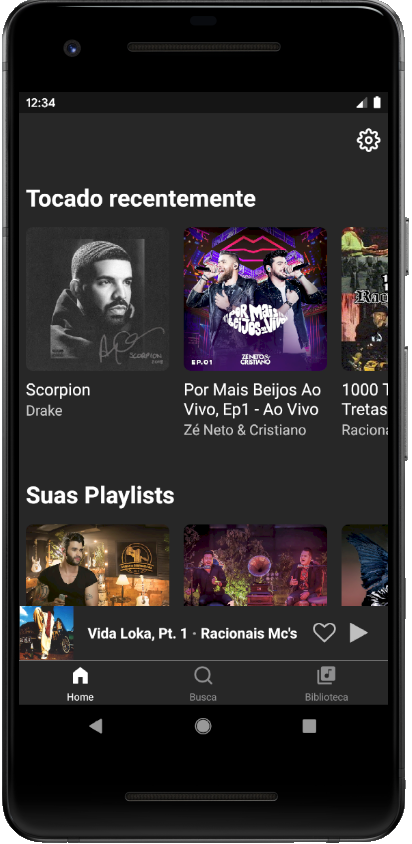
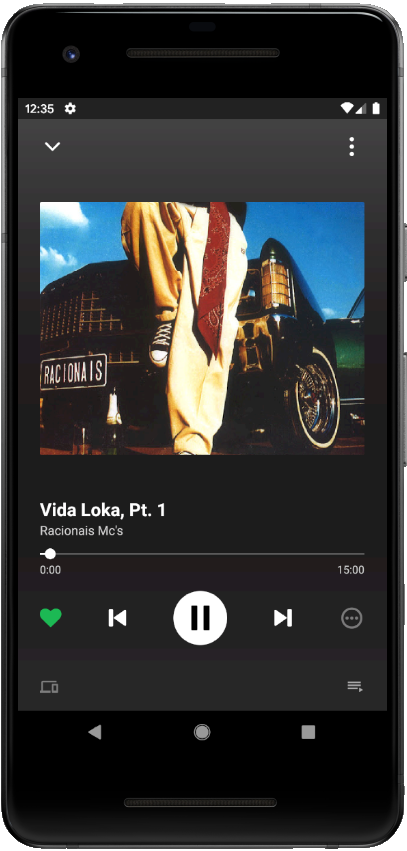
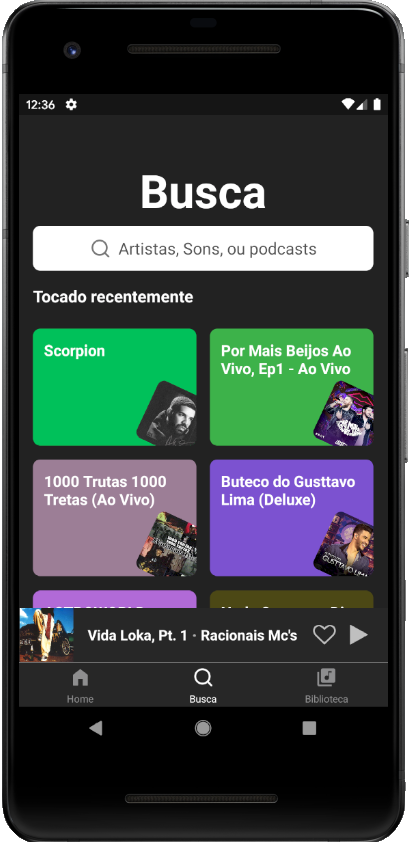

<h1 align="center">
    
</h1>

<h3 align="center">
  💚 Clone spotify 🎵
</h3>

  <a href="#rocket-sobre-o-desafio">Sobre</a>&nbsp;&nbsp;&nbsp;|&nbsp;&nbsp;&nbsp;
  <a href='#gear-oque-foi-utilizado'>Oque foi utilizado</a>&nbsp;&nbsp;&nbsp;|&nbsp;&nbsp;&nbsp;
  <a href="#camera-imagens">Imagens</a>&nbsp;&nbsp;&nbsp;|&nbsp;&nbsp;&nbsp;
  <a href="#Instalar e usar">Instalar e usar</a>

## 🎵 Sobre

 Um clone do spotify para aprender algumas tecnicas de animação com react animated e melhorar meus conhecimentos em desenvolvimento de aplicativos com react native.

 

## ⚙️ Oque foi utilizado

  - React
  - React Native
  - React Native Animation
  - React hooks
  - eslint
  - prettier
  - styled-components
  - react-native-vector-icons

## 📷 Imagens

  
   
  
   
  
   

## 🚀 Instalar e usar

###### Clone o respostiorio. 
``git clone git@github.com:nelsonplinio/rn-spotify.git``

###### Instalar as dependencias. 
``cd rn-spotify ``
`` yarn ou npm install``

###### Instalar as dependencias. 
``yarn android ou yarn ios ``
